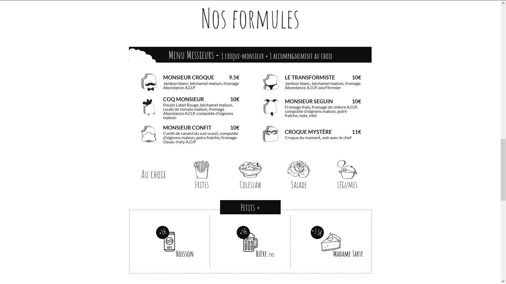
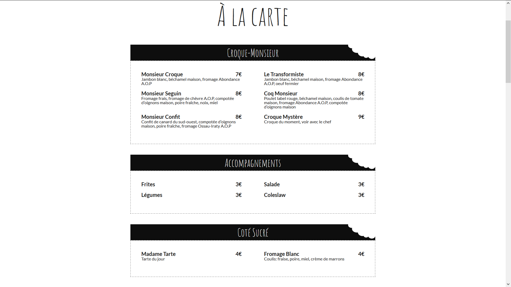
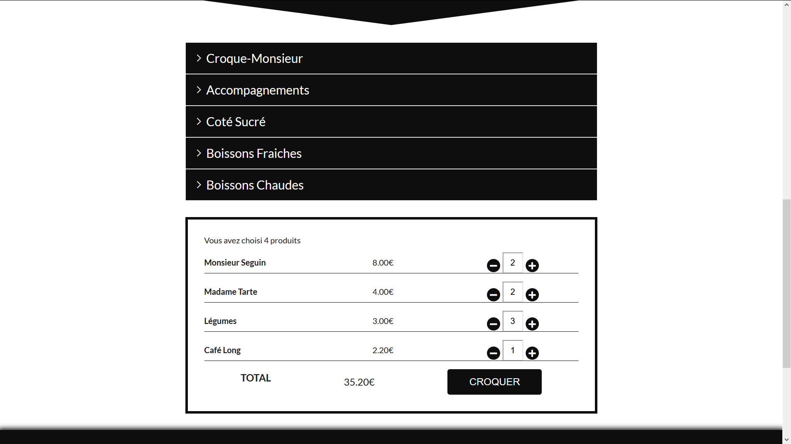
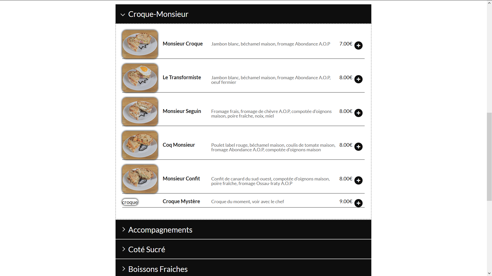
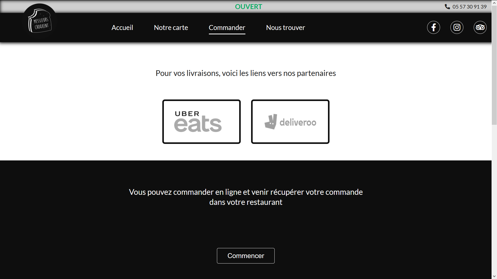
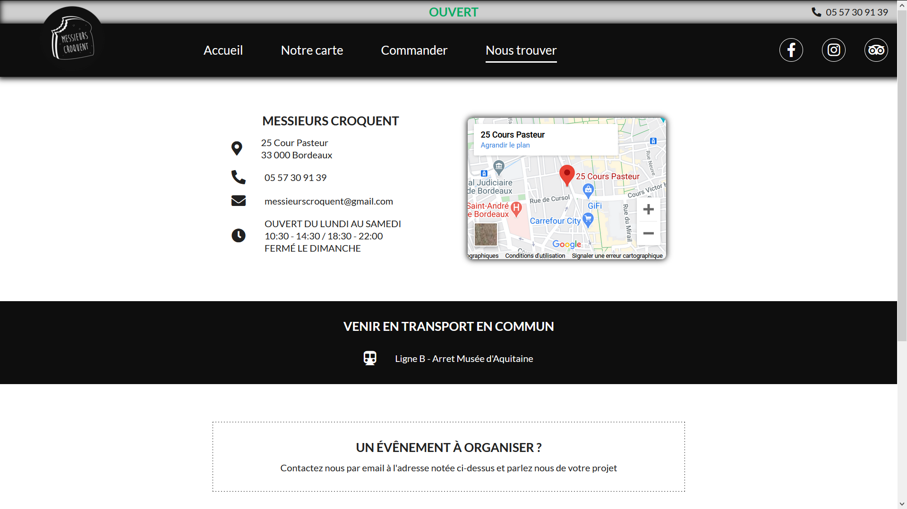

# Project Messieurs Croquent

### This project is the first version of a website made for a real restaurant

 * This website has been designed to present the restaurant and give all the important information to the customer. We decided to develop an online order.
 * It was produced in one month with an AGILE team of 5 juniors developer : 3 Front-End 2 Back-end
 * Available online soon
 * Meanwhile, you can watch the presentation on Youtube https://www.youtube.com/watch?v=9UK4Lxgz-RY&t=485s (in french) 

 ## WebsSite pages : 

 ## Home Page : 

 ## Menu : 

## OrderPage :
 

## FindUs :

